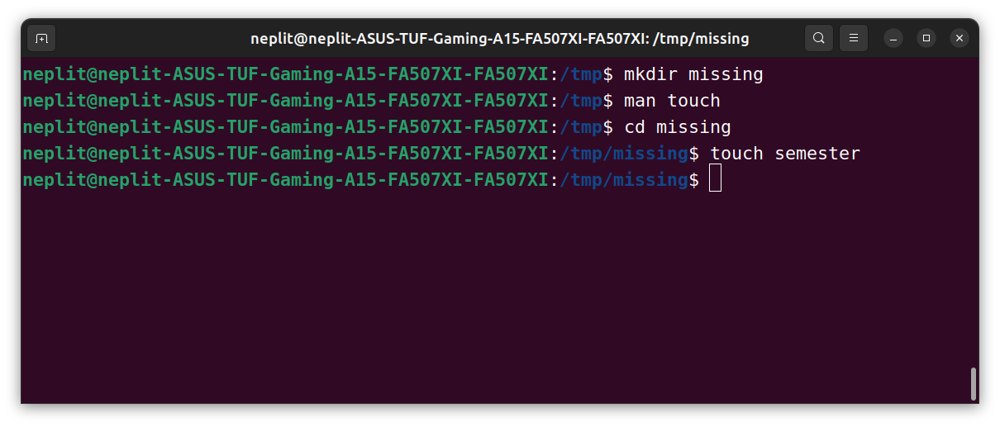
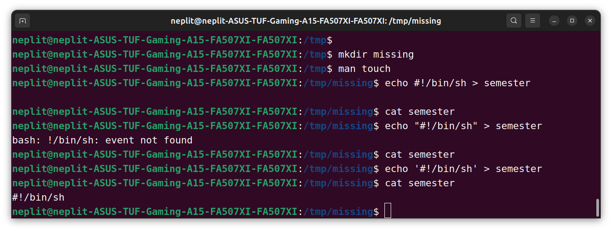
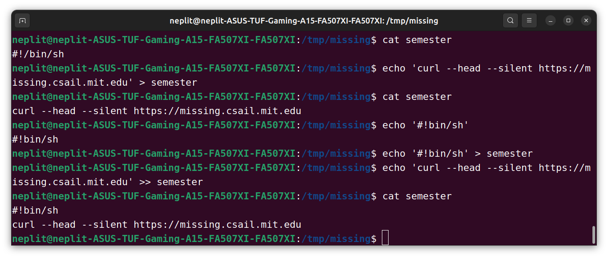
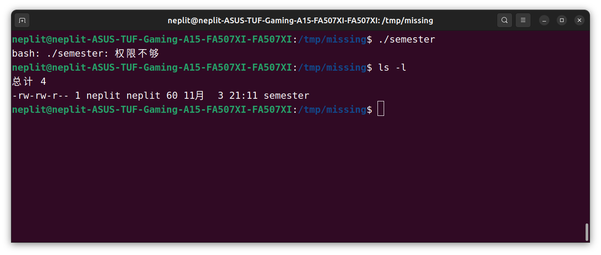
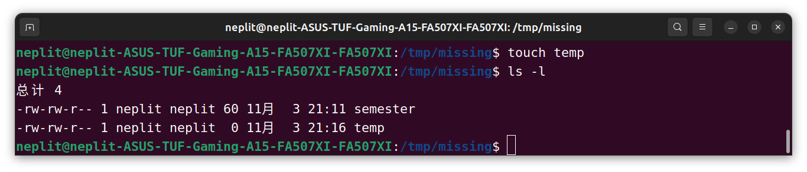
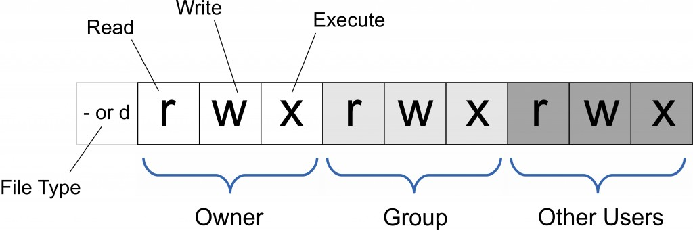
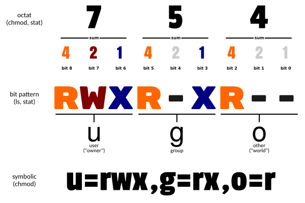
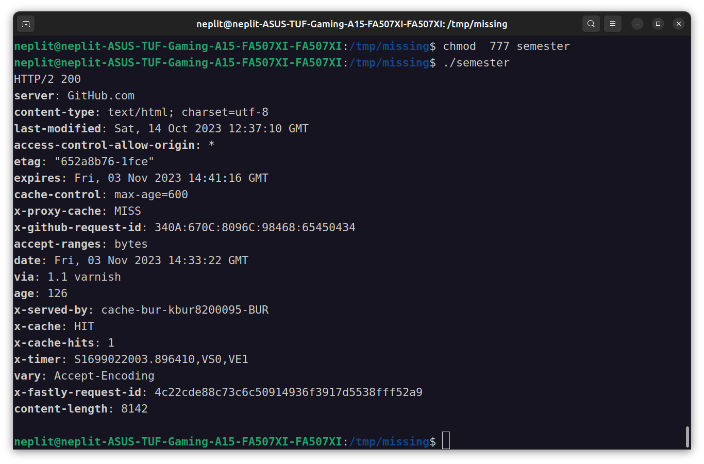
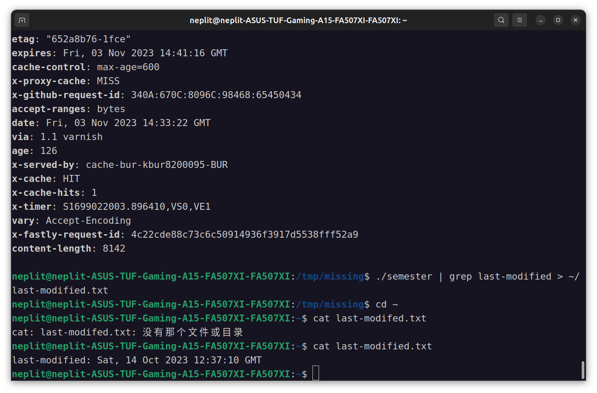
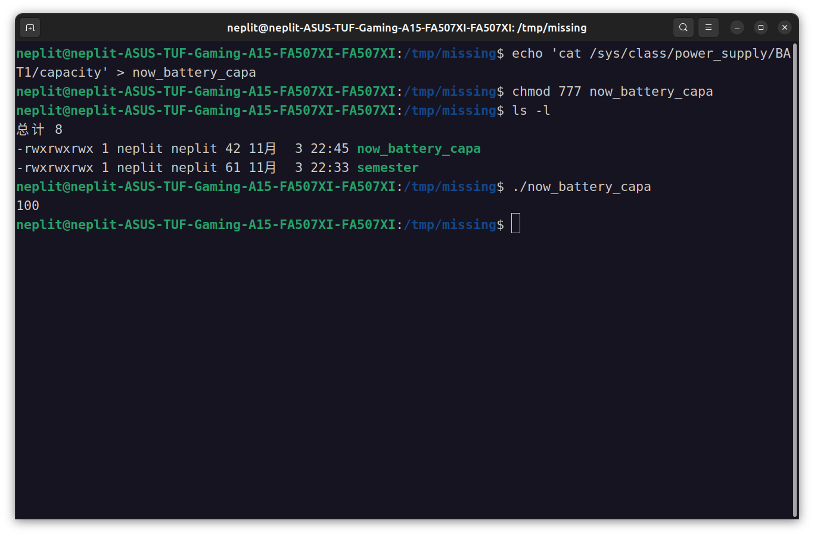

1. 本课程需要使用类Unix shell，例如 Bash 或 ZSH。如果您在 Linux 或者 MacOS 上面完成本课程的练习，则不需要做任何特殊的操作。如果您使用的是 Windows，则您不应该使用 cmd 或是 Powershell；您可以使用Windows Subsystem for Linux或者是 Linux 虚拟机。使用echo $SHELL命令可以查看您的 shell 是否满足要求。如果打印结果为/bin/bash或/usr/bin/zsh则是可以的。
2. 在 /tmp 下新建一个名为 missing 的文件夹。
3. 用 man 查看程序 touch 的使用手册。<br>

---
### touch命令

`touch` 的使用手册分解如下：

```
TOUCH(1)                         User Commands                        TOUCH(1)

NAME
       touch - change file timestamps

SYNOPSIS
       touch [OPTION]... FILE...

DESCRIPTION
       Update  the  access  and modification times of each FILE to the current
       time.
```
`touch` 程序的用途是，其基本语法是 `touch [OPTION]... FILE...` ，可以将 `FILE` 文件的访问时间、修改时间改成当前系统时间。


```
       A FILE argument that does not exist is created empty, unless -c  or  -h
       is supplied.

       A  FILE  argument  string of - is handled specially and causes touch to
       change the times of the file associated with standard output.

       Mandatory arguments to long options are  mandatory  for  short  options
       too.
```

如果指定的 `FILE` 文件并不存在，程序将会创建一个新的 `FILE` 文件，除非 `[OPTION]` 中使用了 `-c` `-h` 等参数。 

```
       -a     change only the access time

       -c, --no-create
              do not create any files

       -d, --date=STRING
              parse STRING and use it instead of current time

       -f     (ignored)

       -h, --no-dereference
              affect each symbolic link instead of any referenced file (useful
              only on systems that can change the timestamps of a symlink)

       -m     change only the modification time

       -r, --reference=FILE
              use this file's times instead of current time

       -t STAMP
              use [[CC]YY]MMDDhhmm[.ss] instead of current time

       --time=WORD
              change the specified time: WORD is access, atime, or use: equiv‐
              alent to -a WORD is modify or mtime: equivalent to -m

       --help display this help and exit

       --version
              output version information and exit

       Note that the -d and -t options accept different time-date formats.

DATE STRING
       The  --date=STRING  is  a mostly free format human readable date string
       such as "Sun, 29 Feb 2004 16:21:42 -0800" or "2004-02-29  16:21:42"  or
       even  "next Thursday".  A date string may contain items indicating cal‐
       endar date, time of day, time zone, day of week, relative  time,  rela‐
       tive date, and numbers.  An empty string indicates the beginning of the
       day.  The date string format is more complex than is easily  documented
       here but is fully described in the info documentation.
```


```
AUTHOR
       Written  by  Paul  Rubin, Arnold Robbins, Jim Kingdon, David MacKenzie,
       and Randy Smith.

REPORTING BUGS
       GNU coreutils online help: <https://www.gnu.org/software/coreutils/>
       Report any translation bugs to <https://translationproject.org/team/>

COPYRIGHT
       Copyright © 2022 Free Software Foundation, Inc.   License  GPLv3+:  GNU
       GPL version 3 or later <https://gnu.org/licenses/gpl.html>.
       This  is  free  software:  you  are free to change and redistribute it.
       There is NO WARRANTY, to the extent permitted by law.

SEE ALSO
       Full documentation <https://www.gnu.org/software/coreutils/touch>
       or available locally via: info '(coreutils) touch invocation'

GNU coreutils 9.1                January 2023                         TOUCH(1)
```

这一栏则列出了 `touch` 程序的作者、反馈方式、版权信息等其他信息。

---

4. 用 touch 在 missing 文件夹中新建一个叫 semester 的文件。

以上步骤运行如图



1. 将以下内容一行一行地写入 semester 文件：
```
#!/bin/sh
curl --head --silent https://missing.csail.mit.edu
```



由图我们可以看到，直接写入的命令似乎没有作用，而双引号包括住要写入的第一行会让 shell 报错。

只有命令 `echo ‘#!/bin/sh’ > semester` 起到了作用。因为 `#` 在Bash中表示注释，而 ! 即使被双引号（"）包裹也具有特殊的含义。 **单引号（'）则不一样，此处利用这一点解决输入问题。**（更多信息请参考 [Bash quoting 手册](https://www.gnu.org/software/bash/manual/html_node/Quoting.html)）

然后写入第二行命令，注意 `>` 的重定义效果是直接覆写，而 `>>` 才是追加内容：



注意到指令 `echo 'curl --head --silent https://missing.csail.mit.edu' > semester` 直接将 semester 文件的内容从 `#!bin/sh` 覆写成了 `curl --head --silent https://missing.csail.mit.edu` 

而 将 `>` 改为 `>>` 才可以*另起一行*并追加内容

6. 尝试执行这个文件。例如，将该脚本的路径（./semester）输入到您的shell中并回车。如果程序无法执行，请使用 ls 命令来获取信息并理解其不能执行的原因。



`-rw-rw-r--` 告诉我们作为一个文件，我作为创建者（neplit）是只有读取和写入的权限，**但没有运行权限**。因此我们运行指令 `./semester` 是会报 access denied 的。



同时这也告诉我们 `touch` 指令创建的文件是不会给我们执行权限的，我们只有读取和写入权限。

7. 查看 `chmod` 的手册(例如，使用 `man chmod` 命令)

---

### chmod命令

`chmod` 的使用手册分解如下：

```
NAME
       chmod - change file mode bits
```

其表明 `chmod` 命令用于修改文件的权限模式。

Linux/Unix 系统的文件调用权限分为三级：文件所有者、用户组与其他用户（这里上课笔记中有）



```
SYNOPSIS
    chmod [OPTION]... MODE[,MODE]... FILE...
    chmod [OPTION]... OCTAL-MODE FILE...
    chmod [OPTION]... --reference=RFILE FILE...

DESCRIPTION
    This  manual page documents the GNU version of chmod.  chmod changes the file mode bits of
    each given file according to mode, which  can  be  either  a  symbolic  representation  of
    changes to make, or an octal number representing the bit pattern for the new mode bits.
```

`chmod` 命令的基本语法是 `chmod [OPTION] MODE[,MODE] FILE` 。其中的 `MODE` 是该命令用于更改文件权限的依据（chmod changes the file mode bits of each given file according to mode），其可以使用**符号表示**（Symbolic representation）或者**八进制数表示**（an octal number representing the bit pattern for the new mode bits）。

```
    The format of a symbolic mode is [ugoa...][[-+=][perms...]...], where perms is either zero
    or more letters from the set rwxXst, or a single letter from the set ugo.   Multiple  sym‐
    bolic modes can be given, separated by commas.


```

**符号表示** 的基本格式是 `[ugoa...][[-+=][perms...]...]` 

如果要同时根据多个符号表示来修改文件权限，不同的符号表示之间可以用逗号分隔开，如下面的指令将两个符号表示 `u+r` 与 `go-r`分开来：

```
chmod u+r,go-r docs
```

该指令修改了文件 docs 的权限：所有者获得了读取权限，而除所有者外其他用户都失去了读取权限。

```
    A  combination  of  the  letters  ugoa  controls  which  users' access to the file will be
    changed: the user who owns it (u), other users in the file's group (g), other users not in
    the  file's  group (o), or all users (a).  If none of these are given, the effect is as if
    (a) were given, but bits that are set in the umask are not affected.

    The operator + causes the selected file mode bits to be added to the  existing  file  mode
    bits  of  each file; - causes them to be removed; and = causes them to be added and causes
    unmentioned bits to be removed except that a directory's unmentioned set user and group ID
    bits are not affected.

    The letters rwxXst select file mode bits for the affected users: read (r), write (w), exe‐
    cute (or search for directories) (x), execute/search only if the file is  a  directory  or
    already  has  execute permission for some user (X), set user or group ID on execution (s),
    restricted deletion flag or sticky bit (t).  Instead of one or more of these letters,  you
    can  specify  exactly one of the letters ugo: the permissions granted to the user who owns
    the file (u), the permissions granted to other users who are members of the  file's  group
    (g),  and  the permissions granted to users that are in neither of the two preceding cate‐
    gories (o).
```


`ugoa` 表示要修改的是哪一类用户的文件权限，其中 u 代表 *user 文件所有者*、 g 代表 *group 用户组内成员*、o 代表 *others 其他用户*， 而 a 代表 *all 所有用户* 。 [ugoa] 的方括号告诉我们这一部分可以省略，而 **省略则默认修改所有人的权限** 。

`[-+=]` 表示要以何种方式修改文件权限。 - 代表删除某权限， + 代表追加某权限 *而不影响其他权限*， = 代表直接设置成某权限 **并删除其他权限**。 比如 -r（删除读取权限）、 +w（增加写入权限）、=r（设置成只可读权限，即增加读取权限，删除执行与写入权限）

`[perms]` 即 permissions，代表要设置的是什么权限：从 字符集`rwxXst` 中选择。 

r 代表读取权， w 代表写入权， x 代表执行权。X为特殊执行权限：只有当文件为目录文件，或者其他类型的用户有可执行权限时，才将文件权限设置可执行。


```
    A numeric mode is from one to four octal digits (0-7), derived by adding up the bits  with
    values  4, 2, and 1.  Omitted digits are assumed to be leading zeros.  The first digit se‐
    lects the set user ID (4) and set group ID (2) and restricted deletion or sticky  (1)  at‐
    tributes.   The second digit selects permissions for the user who owns the file: read (4),
    write (2), and execute (1); the third selects permissions for other users  in  the  file's
    group,  with the same values; and the fourth for other users not in the file's group, with
    the same values.
```

八进制表示是一个三位数。从前到后每一位数都代表了一类用户的文件权限（分别是u、g、o）。数值的确定规则如下：首先将三个不同的权限变成三个数值：4-r, 2-w, x-1。比如 rwx 代表 4+3+1=7, 其八进制表示则是7。r-x 代表 4+0+1=5， --- 代表 0+0+0=0。那么数值 750 就代表了 所有者拥有读取写入执行权、用户组用户拥有读取和执行权，其他用户没有任何权利。



使用八进制表示来使用 `chmod` 命令的语法为：

```
chmod abc file
```
其中a,b,c各为一个数字，分别表示User、Group、及Other的权限。

r=4，w=2，x=1

若要 rwx 属性则 4+2+1=7；

若要 rw- 属性则 4+2=6；

若要 r-x 属性则 4+1=5。

例如
```
chmod a=rwx file
chmod =rwx file
chmod 777 file
```

效果相同，都是将 file 的权限都设为 `rwxrwxrwx` 。

```
chmod ug=rwx,o=x file
chmod 771 file
```

效果相同，都是将 file 的权限设置为 `rwxrwx--x`。

```
    chmod never changes the permissions of symbolic links; the chmod system call cannot change
    their  permissions.   This  is  not  a problem since the permissions of symbolic links are
    never used.  However, for each symbolic link listed on the command line, chmod changes the
    permissions of the pointed-to file.  In contrast, chmod ignores symbolic links encountered
    during recursive directory traversals.
```

---

8. 使用 `chmod` 命令改变权限，使 `./semester` 能够成功执行，不要使用 `sh semester` 来执行该程序。（您的 shell 是如何知晓这个文件需要使用 sh 来解析呢？更多信息请参考：[shebang](https://en.wikipedia.org/wiki/Shebang_(Unix)) ）



9. 使用 | 和 > ，将 semester 文件输出的最后更改日期信息，写入主目录下的 last-modified.txt 的文件中

semester 文件输出的最后更改日期信息（last-modified） 可以利用 `grep` 命令寻找。



9. 写一段命令来从 /sys 中获取笔记本的电量信息，或者台式机 CPU 的温度。注意：macOS 并没有 sysfs，所以 Mac 用户可以跳过这一题。

solution：

- 创建一个文件名为 `now_battery_capa`，其内容为 `cat /sys/class/power_supply/BAT1/capacity` 。
- 将其权限设为可执行



可以看出现在笔记本电量为100.